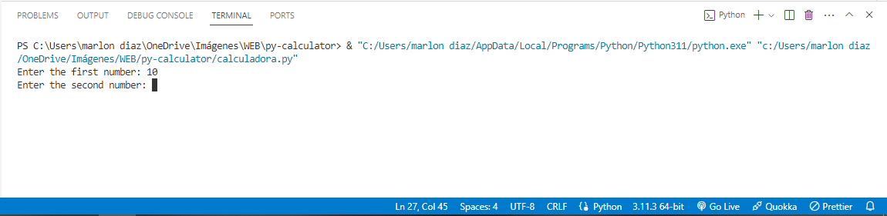
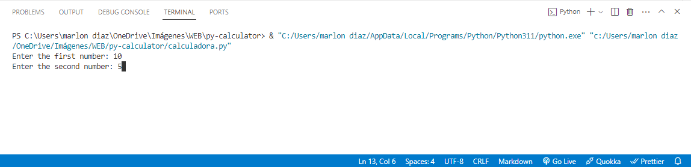
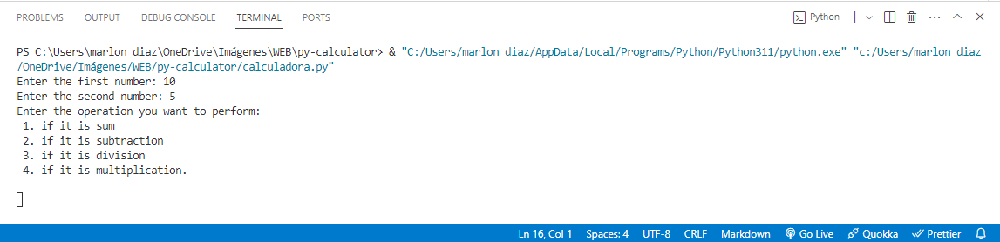
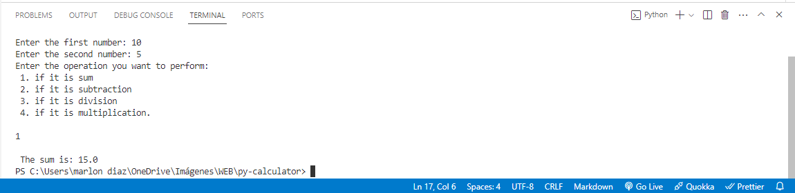

# py-calculator
Simple calculator made in python

## Members

- Leonardo Trujillo Vega- 1152071 - LeonardoTrve@ufps.edu.co
- Kevin Eslava Mantilla - 1152066 - Kevinalexisesma@ufps.edu.co
- Marlon Diaz Torres - 1152054    - Marlonjosedito@ufps.edu.co 

## evidence
get the first number

get the second number

choose the operation

show result 
